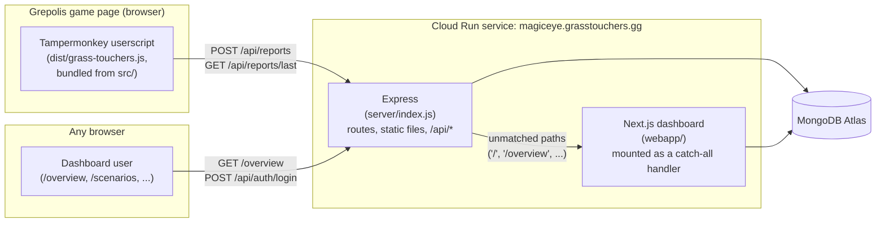
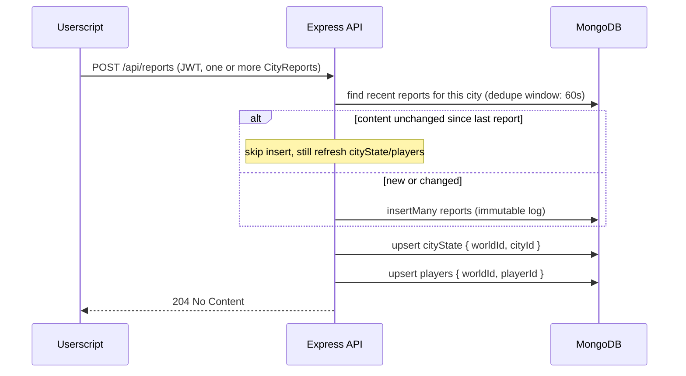
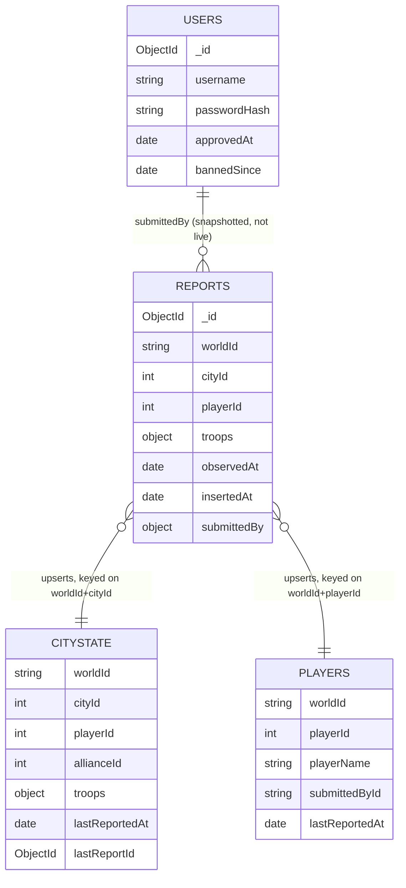
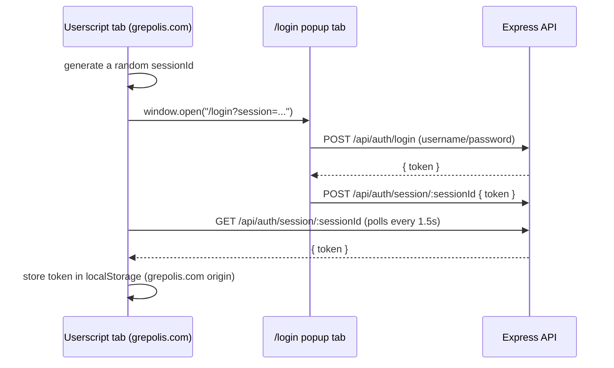

# GT Magic Eye

A Tampermonkey userscript for [Grepolis](https://www.grepolis.com) that indexes troop counts as
you browse your cities, and a backend that aggregates those reports into shared, near-real-time
intel for a team. Branded as **Grass Touchers**, hosted at `magiceye.grasstouchers.gg`.

- **Userscript** (`src/`) — runs on `*.grepolis.com/game/*`, scrapes the currently-open city's
  troop counts (and support garrisons) from the DOM/`window.Game`, and submits them to the API.
- **API + static hosting** (`server/`) — a single Express service: ingests reports, serves the
  install page / userscript files / privacy policy, and hosts the dashboard webapp.
- **Dashboard webapp** (`webapp/`) — a Next.js (TypeScript) app mounted *into* the same Express
  process, at `/overview` etc., for browsing the aggregated data.

See [`PRIVACY.md`](./PRIVACY.md) for what data is collected and why.

## Contents

- [Architecture](#architecture)
- [Data flow: submitting a report](#data-flow-submitting-a-report)
- [Data model](#data-model)
- [Auth](#auth)
- [Repo layout](#repo-layout)
- [Installing the userscript (end users)](#installing-the-userscript-end-users)
- [Local development](#local-development)
- [Building & deploying](#building--deploying)
- [API reference](#api-reference)
- [Configuration reference](#configuration-reference)

## Architecture

Everything server-side is **one deployable** — a single Cloud Run service, deployed straight from
source (no Dockerfile; Google's buildpacks detect Node and run `gcp-build`). The userscript is a
separate artifact entirely: a small installable "shell" that Tampermonkey runs, which in turn
injects the real bundled payload pulled from the server  as a `<script>` tag on the Grepolis page.



The Next.js app isn't run standalone — `server/index.js` imports `next`, builds a request handler
pointed at `webapp/`, and mounts it as `app.all("*", ...)` *after* every other route/static
mount. Anything not already claimed (an explicit route, or a file under `server/public/` or
`dist/`) falls through to Next, including `/` itself. This keeps the whole app on one domain and
one process without coupling the two codebases together — `webapp/` never imports from `server/`
or `src/`, and vice versa.

## Data flow: submitting a report



`reports` is an **append-only log** — every observation, kept forever, never mutated. `cityState`
and `players` are **upserted "current state" projections** derived from it, so a query can ask
"what does this city look like right now" without replaying history. Both projection writes are
best-effort (logged, not fatal) since the report itself is already durably persisted by the time
they run.

## Data model

MongoDB has no foreign keys, so the four collections below are linked only by convention — a
shared field value (`worldId`/`cityId`/`playerId`), not an enforced constraint. Referential
integrity here comes from: consistent natural keys across collections, Zod schema validation
(`server/database/*.js`) immediately before every write, and unique indexes (`server/db.js`)
standing in for "one row per identity."



- **`users`** — site accounts. Created via `npm run create-user` (no self-serve signup yet).
- **`reports`** — immutable history, one document per submitted `CityReport`. `submittedBy` is a
  snapshot of the JWT payload at insert time, not a live reference to `users`.
- **`cityState`** — one document per `{worldId, cityId}`, always reflecting the most recent report
  for that city (handles conquest, renames, alliance changes — a city's identity is the id, not
  whoever currently owns it).
- **`players`** — one document per `{worldId, playerId}`, keyed on the real Grepolis player id
  (`Game.player_id`, stable across in-game renames). `submittedById` is an optional back-reference
  to a `users` account, for the subset of players who are also tool users.

## Auth

Both the userscript and the webapp end up with the same kind of JWT (`server/auth.js`, verified on
every request by `server/middleware/requireAuth.js`), but they get one differently — the
userscript runs on `grepolis.com`, a different origin from the API, so it can't just do a same-page
login form.



The webapp is served from the same origin as the API, so it skips the popup/relay dance entirely
— `webapp/lib/auth.ts` just does a normal `fetch("/api/auth/login")` and stores the token in its
own `localStorage` (a separate origin from the userscript's, so the two never share one).
`server/loginSessions.js` is what bridges the popup and the polling tab: an in-memory,
single-use, 5-minute-TTL map, since `postMessage`/`window.opener` can't be relied on across the
popup boundary (COOP silently nulls `window.opener` even for a real user-clicked link).

## Repo layout

```
.
├── src/                   Userscript source, bundled by esbuild into dist/grass-touchers.js
│   ├── index.js             Entry point: scraping, auth, report submission
│   ├── auth.js               Token storage + login popup/poll flow
│   ├── featureFlags.js
│   └── ui/                   Settings menu, town/stale indicators, login prompt
├── shared/                 Code shared by the userscript AND the server (zod schemas)
│   ├── payload.js             CityReport / ReportPayload schemas
│   └── reportDedup.js
├── server/                 Express API + static hosting (the whole backend, one deployable)
│   ├── index.js               Routes, report ingestion, Next.js mount
│   ├── db.js                   Mongo connection + index setup
│   ├── auth.js                  Login/register (bcrypt + JWT)
│   ├── loginSessions.js
│   ├── database/                 Zod schema per collection (users/reports/cityState/players)
│   ├── middleware/                requireAuth, rate limiting
│   └── public/                     Static pages: install.html, login.html, privacy.html
├── webapp/                 Next.js dashboard (TypeScript), mounted into server/index.js
│   ├── app/                   App Router pages (/, /overview, ...)
│   ├── components/
│   └── lib/                    Auth context + client-side auth helpers
├── scripts/
│   └── createUser.js         CLI: create a users account
├── build.cjs                esbuild bundling for src/ -> dist/grass-touchers.js
├── build-shell.cjs          Generates the installable *.user.js shell (dev + prod)
├── config.cjs                Dev/prod host + API base URLs, shared by build.cjs & build-shell.cjs
└── PRIVACY.md
```

## Installing the userscript (end users)

1. Install the [Tampermonkey](https://www.tampermonkey.net/) browser extension.
2. Visit [`magiceye.grasstouchers.gg/install`](https://magiceye.grasstouchers.gg/install) and
   click **Install GT Magic Eye userscript** — Tampermonkey will prompt you to confirm.
3. Open a city in Grepolis. On first authenticated action you'll be prompted to log in via a popup
   (accounts aren't self-serve yet — ask an admin to run `npm run create-user` for you).

## Local development

### Prerequisites

- Node, via the version pinned in [`.nvmrc`](./.nvmrc): `nvm use`
- The [Tampermonkey](https://www.tampermonkey.net/) extension, for testing the userscript itself
- A MongoDB connection string (Atlas or your own)

### Setup

```bash
nvm use
npm install                  # installs root deps + the webapp/ workspace
cp .env.example .env         # fill in MONGODB_URI, JWT_SECRET, etc.
npm run create-user          # interactive: creates a users account for local login
```

### Running

Most work only needs the API + webapp server:

```bash
npm run server                # boots Express on :8080 (API, static pages, dashboard)
```

`NODE_ENV` isn't set to `production` here, so the mounted Next.js app runs in dev mode
(hot reload) — visit `http://localhost:8080/overview`.

If you're editing the userscript itself (`src/`), also run the esbuild dev server, which serves
the bundled payload on `:8000` and rebuilds on save:

```bash
npm run dev
```

Then install `dist/grass-touchers.dev.user.js` in Tampermonkey — it's a separate shell/namespace
from the prod script, pointed at your local dev hosts (see `config.cjs`), so both can be installed
side by side.

> **WSL2 note:** `localhost` port-forwarding into WSL2 is unreliable, especially after repeated
> bind/kill cycles on a port. `config.cjs` already points dev URLs at the WSL2 VM's real IP
> instead — if a browser (or the userscript, running in a Windows-side browser) can't reach
> `localhost:8080`, use that IP instead. It's recomputed on every build; check `devApiBase` in
> `config.cjs`'s output, or `ip addr show eth0` inside WSL, if it drifts after a restart.

## Building & deploying

```bash
npm run build              # esbuild bundle + shell scripts + next build, all in one
npm run deploy              # gcloud run deploy --source . (single Cloud Run service)
```

`npm run build` (and Cloud Run's own `gcp-build` step, which runs the same three commands) produces:

- `dist/grass-touchers.js` — the bundled userscript payload
- `dist/grass-touchers.user.js` / `dist/grass-touchers.dev.user.js` — the installable shells
- `webapp/.next/` — the Next.js production build

`npm run build:obfuscated` additionally runs the payload (not the shell) through
`javascript-obfuscator` — a deterrent against casual copy/repurposing, not real security (it's
still JS running in the user's own browser, inspectable via devtools regardless).

## API reference

| Method | Path                          | Auth         | Notes                                            |
| ------ | ----------------------------- | ------------ | ------------------------------------------------- |
| GET    | `/install`                    | —            | Static install page                                |
| GET    | `/login`                      | —            | Static popup login page (userscript flow)          |
| GET    | `/privacy`                    | —            | Privacy policy                                     |
| POST   | `/api/auth/login`             | —            | Rate-limited 10/15min per IP; returns `{ token }`  |
| POST   | `/api/auth/session/:sessionId`| —            | Stashes a token for the polling userscript tab      |
| GET    | `/api/auth/session/:sessionId`| —            | Polled by the userscript; 404 until claimed         |
| POST   | `/api/reports`                | Bearer JWT   | Rate-limited 20/min per account                     |
| GET    | `/api/reports/last`           | Bearer JWT   | `?cityId=&worldId=` — last report time for a city   |
| GET    | `/*` (`/overview`, ...)       | —            | Falls through to the Next.js dashboard              |

## Configuration reference

Environment variables (`.env`, see `.env.example`):

| Variable       | Purpose                                                        |
| -------------- | ---------------------------------------------------------------- |
| `MONGODB_URI`  | Atlas (or self-hosted) connection string                          |
| `MONGODB_DB`   | Database name                                                     |
| `JWT_SECRET`   | HMAC secret for signing/verifying auth tokens                     |
| `PORT`         | HTTP port for the Express server (default `8080`)                 |
| `NODE_ENV`     | `production` disables Next.js dev mode for the mounted dashboard  |

Build-time config (`config.cjs`, not environment-driven — baked into the bundle at build time):

| Value           | Purpose                                                                    |
| --------------- | ----------------------------------------------------------------------------- |
| `prodBaseUrl`    | `https://magiceye.grasstouchers.gg` — where the prod shell loads the payload from |
| `devBaseUrl`     | WSL2 VM IP `:8000` — where the dev shell loads the payload from                    |
| `prodApiBase`    | Same host as `prodBaseUrl` in prod (one Cloud Run service serves both)             |
| `devApiBase`     | WSL2 VM IP `:8080` — separate from `devBaseUrl` since dev payload/API run on different ports |
| `staleAfterDays` | Days since a city's last report before the UI flags it as stale (default `3`)      |
